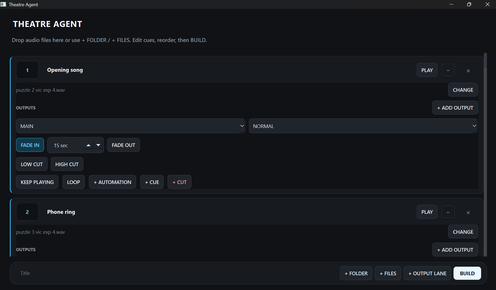
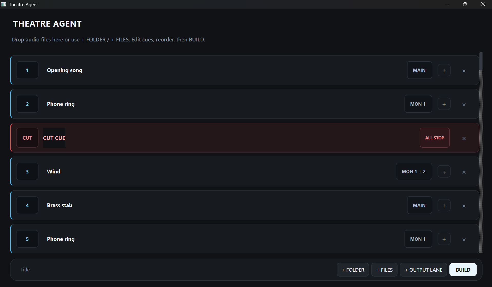
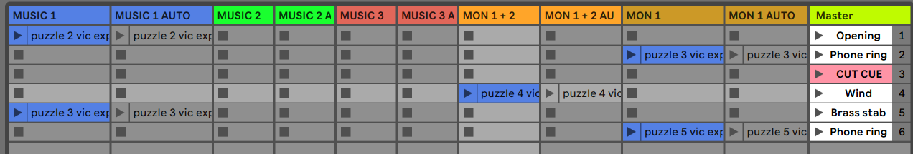

# Theatre Agent

**Build complete Ableton Live theatre sessions from audio files and cue instructions.**

Theatre Agent is a desktop application designed to turn the technical process of building an Ableton Live theatre session into a simple cue-based workflow.

Import your show's audio files, define what each cue should do, and Theatre Agent builds the Ableton Live project for you — including track allocation, routing, levels, fades, automation, looping, EQ, and cue-to-cue playback behavior.
## Interface

### Cue Editor

### Cue List

## The Problem

Ableton Live is powerful enough to run complex theatre playback, but building a show can involve a large amount of repetitive technical work.

Sound designers and operators may need to manually create tracks, place audio, configure outputs, set levels, program fades and automation, manage overlapping cues, and maintain playback behavior across an entire show.

For experienced Ableton users, this takes time.
## What Theatre Agent Can Build

Theatre Agent translates cue-level instructions into a structured Ableton Live session.

It currently supports:

- Automatic track allocation
- Main and monitor output routing
- Custom output lanes with matching automation tracks
- Per-cue playback levels
- Fade-in and fade-out automation
- Multiple fade trigger behaviors
- Overlapping cues
- Persistent playback across cues
- Run-with-previous / linked cue behavior
- Looping with automatic Warp configuration
- Per-cue low-cut and high-cut EQ automation
- Dedicated automation-only cues
- CUT / stop cues
- Selective track stopping and full-stop behavior
- Automatic scene creation and expansion
- Automatic cue naming and organization
- Multi-file and folder import
- Audio preview
- Cue reordering
- Automatic generation of the final Ableton Live project

The generated project opens directly in Ableton Live and remains fully editable by the sound designer or operator.

For theatre professionals who don't know Ableton deeply, it can make the software difficult to use at all.

Theatre Agent separates the creative decision from the technical implementation:

**You define what should happen. Theatre Agent builds the session.**
## How It Works

### 1. Import the show's audio

Add individual audio files, drag and drop multiple files, or import an entire folder.

### 2. Define each cue

Choose what should happen when the cue is triggered — output, level, fades, looping, EQ, playback behavior, and other cue-specific instructions.

### 3. Build

Theatre Agent processes the complete cue sequence and builds the required Ableton Live session automatically.

### 4. Open in Ableton Live

The generated project contains the tracks, scenes, audio clips, routing, automation, cue logic, and organization required by the show.

The session remains a normal, fully editable Ableton Live project.
## Generated Ableton Live Session

TheatreAgent converts cue instructions into a structured Ableton Live session, automatically handling track allocation, routing, automation lanes, and cue placement.

This example shows a generated theatre session with main and monitor playback, paired automation tracks, and a dedicated cut cue.
